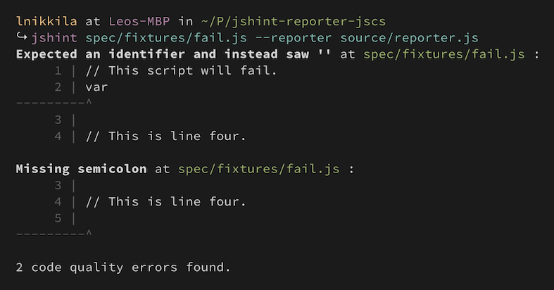

jshint-reporter-jscs
====================

[![Build Status][travis-badge]][travis]
[![Dependencies][david-badge]][david]
[![Code Climate][cc-badge]][cc]

JSHint reporter that looks like the reporter from JSCS. Supports code previews
with line numbering.



#### Installation

```sh-session
$ npm install jshint-reporter-jscs --save-dev
```

#### Usage with [gulp](https://github.com/gulpjs)

```js
return gulp.src(scripts)
    .pipe(jshint())
    .pipe(jshint.reporter('jshint-reporter-jscs'));
```

[travis-badge]: https://img.shields.io/travis/lnikkila/jshint-reporter-jscs/master.svg?style=flat-square
[travis]:       https://travis-ci.org/lnikkila/jshint-reporter-jscs
[david-badge]:  https://img.shields.io/david/lnikkila/jshint-reporter-jscs.svg?style=flat-square
[david]:        https://david-dm.org/lnikkila/jshint-reporter-jscs
[cc-badge]:     https://img.shields.io/codeclimate/github/lnikkila/jshint-reporter-jscs.svg?style=flat-square
[cc]:           https://codeclimate.com/github/lnikkila/jshint-reporter-jscs
